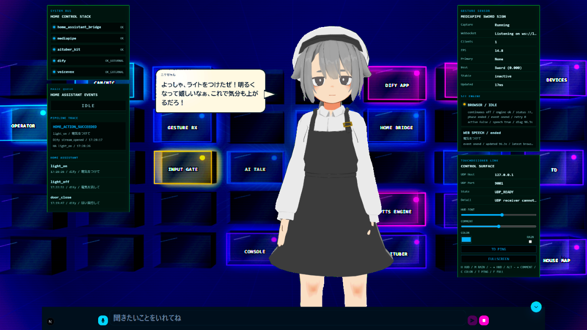
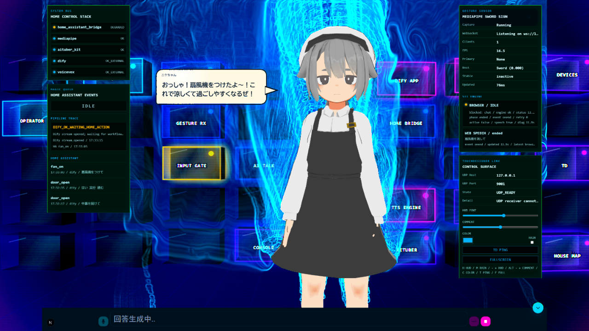

# sword-voice-agent

刀印ジェスチャーを検出している間だけ音声入力を受け付け、STT、Dify、Home Assistant、TTS、アバター表示をつなぐローカル統合アプリです。

このREADMEは、まず動かすための流れを先に示し、その後に`.env`や個別スクリプトの詳細を載せます。

## 概要

このシステムは、複数の小さなモジュールを組み合わせて、次の流れを作ります。

```text
刀印ジェスチャー
  -> マイク入力ON
  -> STT / handoff
  -> Dify
  -> Home Assistant / TTS / Avatar / Projection Visual
```

主な用途は次の通りです。

- 刀印を出している間だけ音声入力する
- Difyへ発話内容を送り、応答やtool side effectを受け取る
- Home Assistant経由でライト、扇風機、ドアなどの家電操作へつなぐ
- Projection VisualでAITuber、ジェスチャー、STT、家電イベント、TouchDesigner連携状態をまとめて見る

## 使用方法

基本操作はこの順番です。

1. `Projection Visual` を開く
2. カメラの前で刀印を出す
3. マイク入力が有効になった状態で話す
4. Difyが応答し、必要に応じてHome Assistantの家電アクションやTTSへつながる
5. HUDの `Pipeline Trace`、`Home Assistant`、`STT Engine`、`Gesture Sensor` で状態を確認する

Projection Visualの例:



Home Assistant側のアクションに接続しておくと、Difyのtool side effectとしてライト、扇風機、ドアなどの家電操作結果もHUDへ流せます。



## 使用モデルについて

上記スクリーンショットのアバターには、inotushop / inunoketu様のオリジナル3Dモデル [「アルバイ子のヌタチさん」](https://booth.pm/ja/items/3262452) を使用しています。柔らかい雰囲気と少し気だるげな表情が、このローカルAITuberの空気感にとても合っており、素晴らしいモデルを公開してくださっていることに深く感謝しています。

BOOTHの商品ページでは、同梱データにVRMが含まれること、利用規約がVN3ライセンスのテンプレートに基づくこと、日本語版規約が優先されることが案内されています。[日本語の規約本文](https://drive.google.com/file/d/1aycsRajtHhtpzTowXzmqbgjfG9RWvSnT/view?usp=sharing)も確認し、個人/法人の利用、映像作品・配信・放送、出版物・電子出版物への利用が許可されていること、クレジット表記が不要であることを確認しました。一方で、未改変データの再配布は禁止され、製品開発等のためのソフトウェアへの組み込みは権利者への個別問い合わせが必要です。

このリポジトリではVRM本体を再配布せず、READMEのスクリーンショットとローカル表示例として掲載しています。利用者が同じモデルを使う場合は、必ずBOOTHの配布ページから正規に入手し、最新の利用規約を確認してください。

## まず用意するもの

### メインPC

開発と表示の中心になるPCです。Windows + Chromeを想定しています。

- Git
- PowerShell
- Python 3.10以上
- `uv`
- Node.js / npm
- Chrome
- マイク
- Webカメラ
- Docker DesktopとDifyローカル環境

AITuber KitのProjection VisualとChrome Web Speech STTはブラウザ上で動きます。Chromeのマイク許可が必要です。

### Raspberry Pi / Home Assistant / 家電

家電連携を行う場合に用意します。必須ではありません。

- Home Assistant本体、またはHome Assistantへつながるサーバー
- スマートライト、扇風機、ドア制御などの対象デバイス
- 常時稼働させたい場合のRaspberry Piや小型PC

このリポジトリ自体はPC側の統合処理を担当します。Raspberry Piは、Home Assistantや実機制御の常時稼働ホストとして使う想定です。

### Dify

- Dify Chat App
- Dify API base URL
- Dify App API key
- 必要ならHome Assistant操作用のtool設定

このリポジトリにはDifyアプリ例として `dify-apps/Home Control Assistant.yml` を置いています。

### ジェスチャーモデル

`mediapipe-sword-sign` 側で作成した `gesture_model.pkl` が必要です。この統合リポジトリではモデルを同梱しません。

刀印は、人差し指と中指をそろえて伸ばし、薬指と小指を折って親指で押さえる手形を目安にしています。


## Gitからのインストール手順

ここでは、外側の作業ディレクトリを `<workspace>` と呼びます。

```powershell
mkdir <workspace>
cd <workspace>
git clone https://github.com/hiro-collab/sword-voice-agent.git sword-voice-agent
cd sword-voice-agent
```

このREADMEの `<repo_root>` は、cloneした内側の `sword-voice-agent` ディレクトリです。

```powershell
cd <workspace>\sword-voice-agent
```

検証用モジュールは、次のスクリプトで `<workspace>` 直下へcloneまたはpullできます。

```powershell
.\scripts\setup-validation-modules.ps1 -DryRun
.\scripts\setup-validation-modules.ps1 -UpdateEnv
```

これで次のcloneが揃います。

```text
<workspace>\
  sword-voice-agent\
  ai-talk-core\
  mediapipe-sword-sign\
  tts-service\
  avatar-service\
  system-house-renderer\
```

Projection VisualやHome Assistant連携まで含める場合は、追加で次のモジュールも用意します。

```powershell
cd <workspace>
git clone https://github.com/hiro-collab/home-assistant-server.git home-assistant-server
git clone https://github.com/hiro-collab/touchdesigner-ai-controller.git touchdesigner-ai-controller
git clone https://github.com/hiro-collab/aituber-kit-sword-private.git aituber-kit
```

`aituber-kit-sword-private` はこのシステム専用のprivate forkです。アクセス権がない場合は、上流の `https://github.com/tegnike/aituber-kit.git` を確認してください。

Python側の基本セットアップ:

```powershell
cd <repo_root>
uv sync
```

AITuber Kit側の基本セットアップ:

```powershell
cd <workspace>\aituber-kit
npm install
```

## 実行方法

### 1. `.env`を作る

```powershell
cd <repo_root>
Copy-Item .env.example .env
notepad .env
```

最低限、次を確認します。

- `DIFY_BASE_URL`
- `DIFY_API_KEY`
- `MEDIAPIPE_SWORD_SIGN_MODEL_PATH`
- 各モジュールの `*_ROOT`

秘密情報を含むため、`.env` はコミットしません。

読み込み確認:

```powershell
.\scripts\load-env.ps1
$env:AI_TALK_CORE_ROOT
$env:DIFY_BASE_URL
```

### 2. Home Control Stackを起動する

Projection Visual、AITuber Kit、MediaPipe Camera Hub、Dify watcher、Home Assistant bridge、TouchDesigner control GUIをまとめて動かす現行の一括起動です。

正本はこの統合リポジトリの `scripts\home-control-stack\` にあります。`<workspace>` 直下の `.bat` と `scripts\*.ps1` は互換用ショートカットです。

```text
<workspace>\
  start-home-control-stack.bat
  status-home-control-stack.bat
  stop-home-control-stack.bat
  scripts\
    start-home-control-stack.ps1
    status-home-control-stack.ps1
    stop-home-control-stack.ps1
    run-home-control-fault-e2e.ps1

<workspace>\sword-voice-agent\scripts\home-control-stack\
  start-home-control-stack.ps1
  status-home-control-stack.ps1
  stop-home-control-stack.ps1
  run-home-control-fault-e2e.ps1
  install-root-shortcuts.ps1
```

通常は `<workspace>` 直下から起動します。

```powershell
cd <workspace>
.\start-home-control-stack.bat -StopExisting
```

MediaPipe の Browser Monitor GUI も一緒に開き、MediaMTX 経由のカメラ映像まで確認したい場合は `mediamtx` モードを使います。

```powershell
cd <workspace>
.\start-home-control-stack.bat -StopExisting -MediapipeMode mediamtx
```

このモードでは `mediapipe-sword-sign\scripts\camera_hub_stack.py` を起動し、MediaMTX、FFmpeg publish、Camera Hub、Browser Monitor をまとめて扱います。カメラ名が違う場合は次のように指定します。

```powershell
.\start-home-control-stack.bat -StopExisting -MediapipeMode mediamtx -MediapipeCameraName "HD Pro Webcam C920"
```

状態確認と停止:

```powershell
.\status-home-control-stack.bat
.\stop-home-control-stack.bat
```

失敗注入を含むDify/Home Controlの全パターン確認:

```powershell
.\scripts\run-home-control-fault-e2e.ps1 -NoOpenBrowser -DelayBetweenCasesSeconds 1
```

rootショートカットを作り直す場合:

```powershell
cd <repo_root>
.\scripts\home-control-stack\install-root-shortcuts.ps1 -WorkspaceRoot ..
```

### 3. 旧full-stackを使う場合

まず起動予定だけ確認します。

```powershell
cd <repo_root>
.\scripts\start-full-stack.ps1 -DryRun
```

問題なければ起動します。

```powershell
.\scripts\start-full-stack.ps1 -Preview -SuppressProtobufWarnings
```

1つのターミナルにまとめたい場合:

```powershell
.\scripts\start-full-stack-supervisor.ps1 -Preview -SuppressProtobufWarnings
```

この旧full-stack系スクリプトは、`ai-talk-core`、UDP receiver、TTS service、Avatar serviceなどを個別に束ねる従来構成です。Home Control Stackの現行運用では、上の `start-home-control-stack.bat` を使います。

### 4. Projection Visualを開く

AITuber Kitを起動します。

```powershell
cd <workspace>\aituber-kit
npm run dev
```

ブラウザで開きます。

```text
http://127.0.0.1:3000/projection-visual
```

Chromeのマイク権限を許可してください。

### 5. 動作確認する

起動後は、まずmodule cardを確認します。

- `ai_talk_core Web UI`
- `Gesture UDP receiver`
- `MediaPipe UDP publisher`
- `Dify API`
- `Dify watcher`
- `TTS service`
- `Avatar service`
- `Integration console`
- `aituber_kit`
- `home_assistant_bridge`

次に、刀印を出した状態で短く発話します。

```text
Gesture: idle -> active
Input Gate: disabled -> enabled
Voice: ready -> transcript/command 更新
Dify: ready -> answer 更新
Home Assistant: action 更新
```

起動後によく見る画面:

```text
ai_talk_core Web UI:        http://127.0.0.1:8000
sword-voice-agent console: http://127.0.0.1:8790
Projection Visual:          http://127.0.0.1:3000/projection-visual
```

### 6. 停止する

起動したPowerShellウィンドウで `Ctrl+C` を押します。

残ったプロセスを止めたい場合:

```powershell
cd <repo_root>
.\scripts\stop-full-stack.ps1
.\scripts\stop-full-stack.ps1 -Force
```

## 関連モジュール

| モジュール | 役割 | Git URL |
|---|---|---|
| `sword-voice-agent` | ローカル統合、起動スクリプト、Dify/Home Assistant連携 | `https://github.com/hiro-collab/sword-voice-agent.git` |
| `ai-talk-core` | STT/Whisper、入力ゲート、agent handoff | `https://github.com/hiro-collab/ai-talk-core.git` |
| `aituber-kit` | Projection Visual、AITuber UI、Chrome Web Speech STT、Dify proxy | `https://github.com/hiro-collab/aituber-kit-sword-private.git` |
| `mediapipe-sword-sign` | 刀印ジェスチャー検出、WebSocket/UDP配信 | `https://github.com/hiro-collab/mediapipe-sword-sign.git` |
| `home-assistant-server` | Home Assistant bridge、家電操作API | `https://github.com/hiro-collab/home-assistant-server.git` |
| `tts-service` | Dify応答のTTS化、VOICEVOX/Windows SAPI等の読み上げ連携 | `https://github.com/hiro-collab/tts-service.git` |
| `avatar-service` | Three.js/VRM avatar runtime | `https://github.com/hiro-collab/avatar-service.git` |
| `system-house-renderer` | システム構成・authority・イベントフローの可視化 | `https://github.com/hiro-collab/system-house-renderer.git` |
| `touchdesigner-ai-controller` | TouchDesigner連携GUI、UDP control surface | `https://github.com/hiro-collab/touchdesigner-ai-controller.git` |

## 詳細設定

### モジュール配置

| 項目 | 例 | 説明 |
|---|---|---|
| `AI_TALK_CORE_ROOT` | `..\ai-talk-core` | `ai-talk-core` cloneの場所 |
| `MEDIAPIPE_SWORD_SIGN_ROOT` | `..\mediapipe-sword-sign` | `mediapipe-sword-sign` cloneの場所 |
| `TTS_SERVICE_ROOT` | `..\tts-service` | `tts-service` cloneの場所 |
| `AVATAR_SERVICE_ROOT` | `..\avatar-service` | `avatar-service` cloneの場所 |
| `SYSTEM_HOUSE_RENDERER_ROOT` | `..\system-house-renderer` | `system-house-renderer` cloneの場所 |

### ai_talk_core

| 項目 | 例 | 説明 |
|---|---|---|
| `AI_TALK_CORE_INPUT_GATE_URL` | `http://127.0.0.1:8000/api/input-gate` | 入力ゲートAPI |
| `AI_TALK_CORE_WEB_TOKEN` | 空、または任意の長い文字列 | local API用トークン |
| `AI_TALK_CORE_RUNTIME_STATUS_FILE` | `.cache\sword_voice_agent\runtime\ai_talk_core.json` | runtime status JSON |

`AI_TALK_CORE_WEB_TOKEN` が空の場合、`start-full-stack.ps1` が一時トークンを生成して各プロセスへ共有します。

### mediapipe-sword-sign

| 項目 | 例 | 説明 |
|---|---|---|
| `MEDIAPIPE_SWORD_SIGN_MODEL_PATH` | `gesture_model.pkl` | 使用するジェスチャーモデル |
| `MEDIAPIPE_SWORD_SIGN_MODEL_SHA256` | 空、またはSHA-256 | モデル検証用hash |
| `MEDIAPIPE_SWORD_SIGN_ALLOW_UNTRUSTED_MODEL` | `0` | hash未検証モデルの読み込み許可 |
| `MEDIAPIPE_SWORD_SIGN_HEARTBEAT_EVERY` | `1s` | 診断heartbeat間隔 |
| `MEDIAPIPE_SWORD_SIGN_LATENCY_PROFILE` | 空、または `low` | publisher側の低遅延preset |
| `MEDIAPIPE_SWORD_SIGN_STATE_EVERY` | 空、または `off` | `gesture_state`送信間隔 |
| `MEDIAPIPE_SWORD_SIGN_EDGE_ONLY` | `0` | edge中心で送る場合は `1` |
| `MEDIAPIPE_SWORD_SIGN_RUNTIME_STATUS_FILE` | `.cache\sword_voice_agent\runtime\mediapipe_udp_publisher.json` | runtime status JSON |
| `MEDIAPIPE_SWORD_SIGN_CONTROL_HTTP_HOST` | `127.0.0.1` | control HTTP host |
| `MEDIAPIPE_SWORD_SIGN_CONTROL_HTTP_PORT` | `18765` | control HTTP port |
| `MEDIAPIPE_SWORD_SIGN_CONTROL_TOKEN` | 空、または任意の長い文字列 | loopback外bind時のtoken |

`gesture_model.pkl` はpickle/joblib形式です。信頼できないファイルを使わず、自分で収集・学習したモデルを使うのが基本です。

代表的な学習の流れ:

```powershell
cd <workspace>\mediapipe-sword-sign
uv run collect_data.py
uv run train_model.py
uv run predict.py
```

### Dify

| 項目 | 例 | 説明 |
|---|---|---|
| `DIFY_BASE_URL` | `http://localhost:8080/v1` | Dify API URL |
| `DIFY_API_KEY` | `<dify_app_api_key>` | DifyアプリのAPIキー |
| `DIFY_USER` | `local-user` | Dify conversationのuser識別子 |
| `DIFY_RESPONSE_MODE` | `streaming` | `streaming` または `blocking` |
| `AITUBER_MESSAGE_URL` | `http://127.0.0.1:3000/api/messages?clientId=<client_id>&type=direct_send` | Dify streaming応答をAITuberKitの発話キューへ送るURL。空なら無効 |
| `AITUBER_HTTP_TIMEOUT_S` | `0.75` | AITuberKit direct_send POST timeout |
| `AITUBER_SPEECH_MAX_CHARS` | `80` | 句点が来ないstreaming応答を発話キューへflushする目安文字数 |

`DIFY_BASE_URL` が `localhost` / `127.0.0.1` の場合、起動前にDocker engineとDify APIの到達性を確認します。

### TTS

| 項目 | 例 | 説明 |
|---|---|---|
| `TTS_OUTPUT_STATUS_DIR` | `.cache\tts_service` | TTS state出力先 |
| `TTS_SOURCE` | `http` | `http` または `status-file` |
| `TTS_HTTP_HOST` | `127.0.0.1` | HTTP source host |
| `TTS_HTTP_PORT` | `8765` | HTTP source port |
| `TTS_HTTP_CHUNK_MAX_CHARS` | `80` | streaming deltaのchunk最大文字数 |
| `TTS_HTTP_CHUNK_URL` | `http://127.0.0.1:8765/api/tts/chunk` | Dify watcherからTTSへ送るURL |
| `TTS_VOLUME_URL` | `http://127.0.0.1:8765/api/volume` | 音量API |
| `TTS_VOLUME_PREVIEW_URL` | `http://127.0.0.1:8765/api/volume/preview` | 確認音API |
| `TTS_HTTP_TIMEOUT_S` | `0.75` | TTS HTTP POST timeout |
| `TTS_ENGINE` | `windows-sapi` | `windows-sapi` または `noop` |
| `TTS_PLAYER` | `speaker` | `speaker` / `file` / `noop` |
| `TTS_POLL_INTERVAL` | `1.0` | 監視間隔 |
| `TTS_VOICE_NAME` | 空、またはSAPI音声名 | Windows SAPI音声名 |
| `TTS_RATE` | `0` | 読み上げ速度 |
| `TTS_VOLUME` | `100` | 合成時音量 |
| `TTS_APP_VOLUME` | `1.0` | tts-service側の実行時音量 |
| `TTS_SERVICE_APP_VOLUME_FILE` | `.cache\tts_service\app_volume.json` | 音量共有JSON |
| `TTS_OUTPUT_AUDIO_DIR` | `.cache\tts_service\audio_output` | `TTS_PLAYER=file` の出力先 |
| `TTS_SERVICE_RUNTIME_STATUS_FILE` | `.cache\sword_voice_agent\runtime\tts_service.json` | runtime status JSON |
| `TTS_SERVICE_SHUTDOWN_TOKEN` | 空、または任意の長い文字列 | loopback外bind時のtoken |

音を出したくない確認では `-TtsEngine noop`、TTS自体を起動しない場合は `-DisableTts` を使います。

### avatar-service

| 項目 | 例 | 説明 |
|---|---|---|
| `AVATAR_SERVICE_URL` | `http://127.0.0.1:5173` | Three.js + VRM avatar runtime |
| `AVATAR_MODEL_URL` | 空、または `/models/Nutachisan.vrm` | VRM model URL |
| `AVATAR_SERVICE_RUNTIME_STATUS_FILE` | `.cache\sword_voice_agent\runtime\avatar_service.json` | runtime status JSON |

`AVATAR_MODEL_URL` が空の場合、avatar-service側の `public\models` からVRMを自動選択します。

### SystemHouseRenderer

| 項目 | 例 | 説明 |
|---|---|---|
| `SYSTEM_HOUSE_RENDERER_RUNTIME_STATUS_FILE` | `.cache\sword_voice_agent\runtime\system_house_renderer.json` | render実行時のstatus JSON |

### セキュリティと表示

| 項目 | 例 | 説明 |
|---|---|---|
| `SWORD_VOICE_AGENT_AUTH_TOKEN` | 空、または任意の長い文字列 | loopback外bind時のHTTP/UDP/console token |
| `SWORD_VOICE_AGENT_REDACT_STATUS` | `0` | `1` でstatus本文、ID、ローカルパスをredact |

`.env` には個人の絶対パス、Dify API key、認証tokenを入れるため、コミットしません。URLに `user:password@host` のような認証情報を埋め込む設定も拒否します。

### ジェスチャー判定

| 項目 | 例 | 説明 |
|---|---|---|
| `SWORD_VOICE_AGENT_MIN_CONFIDENCE` | `0.8` | 刀印として扱う最小confidence |
| `SWORD_VOICE_AGENT_ACTIVATION_DELAY` | `0.3` | 録音開始まで刀印が継続する必要がある秒数 |
| `SWORD_VOICE_AGENT_RELEASE_DELAY` | `0.5` | 刀印が消えてから録音停止までの猶予秒数 |

検出が不安定な環境で一時的に試す例:

```powershell
.\scripts\start-full-stack.ps1 -Preview -GestureActivationDelay 0.1 -GestureMinConfidence 0.7
```

対応版 `mediapipe-sword-sign` で低遅延edge中心に寄せる例:

```powershell
.\scripts\start-full-stack.ps1 -MediapipeLatencyProfile low -MediapipeEdgeOnly -GestureActivationDelay 0.1 -GestureReleaseDelay 0.1
```

## よく使う起動オプション

| Option | 用途 |
|---|---|
| `-DryRun` | 起動せず、実行予定のコマンドだけ表示 |
| `-Preview` | `mediapipe-sword-sign` のOpenCV previewを表示 |
| `-SuppressProtobufWarnings` | MediaPipe / protobuf warningを抑制 |
| `-SkipAiTalkCore` | すでに `ai_talk_core` を起動済みの場合に省略 |
| `-SkipMediapipe` | カメラ送信を起動しない |
| `-SkipDifyWatch` | Dify watcherを起動しない |
| `-SkipConsole` | 統合コンソールを起動しない |
| `-Background` | 各モジュールを隠しプロセスとして起動し、ログを `.cache\sword_voice_agent\logs` に保存 |
| `start-full-stack-supervisor.ps1` | 1つのターミナルに全モジュールのログをprefix付きで集約 |
| `-DisableTts` | tts-serviceを起動しない |
| `-DisableAvatar` | avatar-serviceを起動しない |
| `-SkipDockerCheck` | Docker Desktop / Dify APIの起動前チェックを省略 |
| `-NoStartDockerDesktop` | Docker Desktopを自動起動しない |
| `-NoAiTalkCoreIntegrationDefaults` | `ai_talk_core` Web UIの統合向け初期設定を入れない |
| `-NoRecordGateAuto` | `入力ゲートで録音を制御する` だけ入れない |
| `-NoSaveHandoff` | `handoffを保存する` だけ入れない |
| `-NoSkipShortAscii` | 短い英字1語のSTT結果もDifyへ送る |
| `-DifyResponseMode blocking\|streaming` | Dify watcherの応答モードを上書き |
| `-GestureMinConfidence <number>` | receiverの最小confidenceを上書き |
| `-GestureActivationDelay <seconds>` | 録音開始までの継続秒数を上書き |
| `-GestureReleaseDelay <seconds>` | 録音停止までの猶予秒数を上書き |
| `-TtsEngine windows-sapi\|noop` | TTSエンジンを上書き |
| `-TtsPlayer speaker\|file\|noop` | TTSの再生先を上書き |
| `-AvatarPort <port>` | avatar-serviceのVite portを上書き |
| `-AvatarModelUrl <url>` | avatar-serviceに渡すmodel URLを上書き |

## 個別に起動する

切り分けたい場合は、個別スクリプトを使います。各スクリプトは既定で `.env` を読み込みます。

| Script | 起動するもの |
|---|---|
| `.\scripts\start-ai-talk-core.ps1` | `ai_talk_core` Web UI |
| `.\scripts\start-gesture-udp.ps1` | sword-voice-agent UDP receiver |
| `.\scripts\start-mediapipe-udp.ps1` | mediapipe-sword-sign UDP publisher |
| `.\scripts\start-dify-watch.ps1` | ai_talk_core handoff -> Dify watcher |
| `.\scripts\start-tts-service.ps1` | Dify応答 -> tts-service watcher |
| `.\scripts\start-avatar-service.ps1` | Three.js + VRM avatar runtime |
| `.\scripts\start-console.ps1` | 統合コンソール |
| `.\scripts\start-full-stack-supervisor.ps1` | 1ターミナル集約supervisor起動 |
| `.\scripts\render-system-house.ps1` | `/api/events` -> SystemHouseRenderer trace |
| `.\scripts\start-demo-udp.ps1` | デモ用gesture UDP sender |
| `.\scripts\stop-full-stack.ps1` | 統合プロセスを検出して停止 |

例:

```powershell
cd <repo_root>
.\scripts\start-dify-watch.ps1 -DryRun
.\scripts\start-console.ps1
```

`/api/events` をSystemHouseRendererでtrace表示する場合:

```powershell
.\scripts\render-system-house.ps1
.\scripts\render-system-house.ps1 -TurnId <turn-id>
```

## チェック

コードとPowerShellスクリプトの基本チェック:

```powershell
cd <repo_root>
.\scripts\check.ps1
```

期待する結果:

```text
Ran ... tests
OK
```

## 古いstatus表示を消す

```powershell
cd <repo_root>
$env:PYTHONPATH = "src"
python -m sword_voice_agent.apps.clear_status --status-dir .cache\sword_voice_agent --yes
```

統合コンソールを起動している場合は、画面右上の `履歴クリア` でも同じstatusキャッシュとイベント履歴を削除できます。
