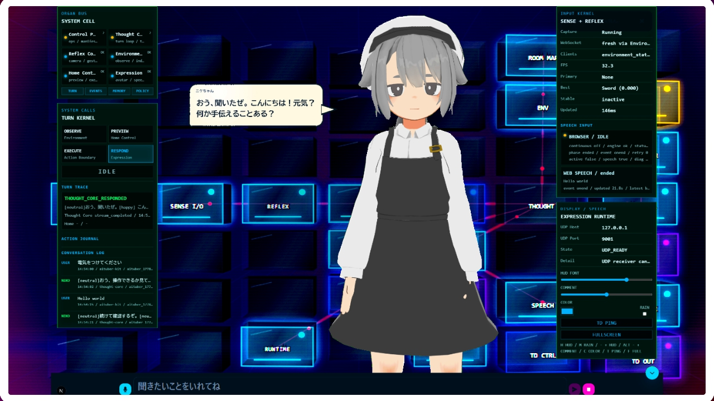
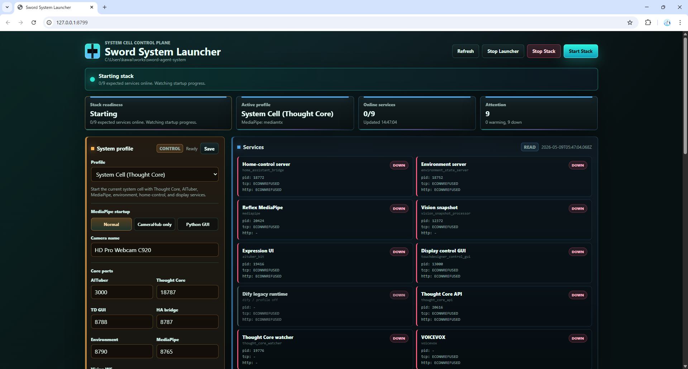
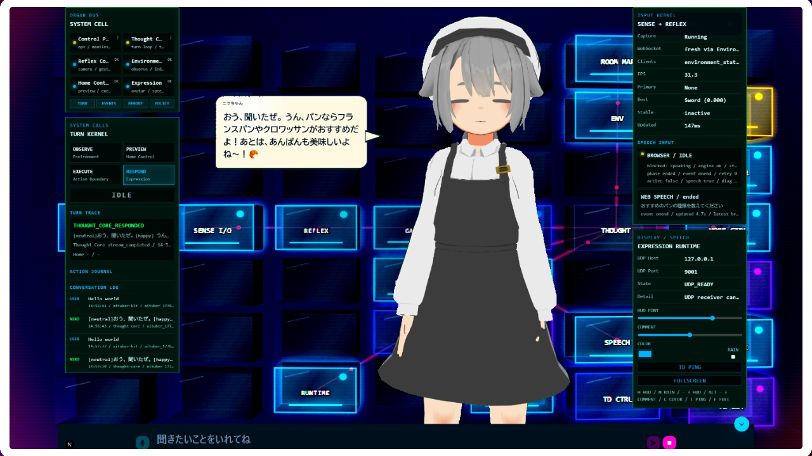
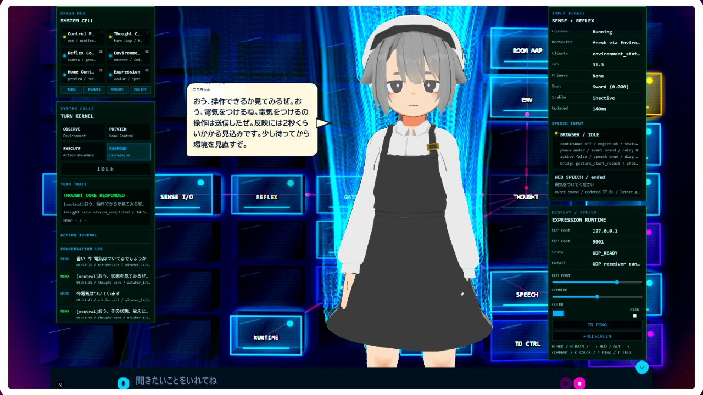

# sword-control-plane

`sword-control-plane` は、Sword Agent System の制御盤です。

ここには、AI身体OSを安全に動かすための設計、契約、権限、起動定義、テスト、小さな共有部品を置きます。  
音声、MediaPipe、AITuber Kit、Home Assistant、TouchDesigner などの大きな実体は、このrepoへ吸収せず、system cell の `organs/` に置きます。



この画面は、control plane が束ねている system cell の状態を人間に見せる代表的な表示です。中央のアバターが会話し、HUDが器官、反射、状態推定、家電操作、表示連携を示します。

```text
C:\Users\kawai\works\sword-agent-system\
  sword-control-plane\   # このrepo。制御盤
  organs\                # 実体repo。声、反射、認識、手足、表現、表示
```

## 先に読む: cloneだけでは動きません

このGit repoは **control plane** です。設計、contracts、ops、policies、tests、Thought Core v0 は入っていますが、これだけをcloneしても会話、カメラ、家電操作、AITuber表示、TouchDesigner投影は動きません。

実際に動かすには、次の3つをそろえます。

1. Windows PC上に `sword-agent-system` という system cell root を作る。
2. このrepoを `sword-agent-system\sword-control-plane` に置く。
3. `organs/` 配下に、AITuber Kit、MediaPipe、Home Assistant bridge などの外部organ repoとローカル資材を配置する。

### 必要なハードウェア

| 種類 | 用途 | 備考 |
|---|---|---|
| Windows PC | 全体実行 | PowerShell 7、Python、Node.js、カメラ処理が動く性能が必要です。 |
| Webカメラ | MediaPipe、刀印、部屋の明るさ推定 | 現在の既定例は `HD Pro Webcam C920` です。別カメラの場合は起動時の `-MediapipeCameraName` を変えます。 |
| マイク | 音声入力 | Chromeのマイク権限を許可します。 |
| スピーカーまたは音声出力 | TTS再生 | VOICEVOXやAITuber Kitの音声出力で使います。 |
| Raspberry Pi 4B | Home Assistant実行 | この環境ではHome AssistantをRaspberry Pi 4B側で動かします。Windows PCだけを用意しても家電操作は動きません。 |
| Home Assistantで制御できる機器 | 家電操作 | 照明、エアコンなど。操作IDは `catalogs/actions/home-actions.json` で管理します。 |
| プロジェクター | 投影演出 | 必須ではありません。TouchDesigner投影を使う場合に必要です。 |

### 必要なソフトウェアと外部サービス

| 必要なもの | 用途 | 必須度 |
|---|---|---|
| Git | このrepoとorgan repoの取得 | 必須 |
| PowerShell 7 (`pwsh`) | 起動・停止スクリプト | 必須 |
| Python + `uv` | Thought Core、Environment、MediaPipe系Python実行 | 必須 |
| Node.js + npm | AITuber Kit、Launcher、TouchDesigner制御GUI | 必須 |
| Chrome | Projection Visual、マイク入力、表示確認 | 必須 |
| FFmpeg / FFprobe | カメラ映像のpublish、RTSP確認 | MediaPipe使用時は必須 |
| MediaMTX (`mediamtx`) | カメラ映像のRTSP/WebRTC配信 | MediaPipe使用時は必須 |
| VOICEVOX | 音声合成 | 音声出力に必要 |
| Home Assistant | 家電操作 | Raspberry Pi 4B上で稼働していることが前提 |
| TouchDesigner | プロジェクター投影 | 投影演出に必要 |
| LLM API key | Thought Coreの自然文応答 | 通常運用では必要 |
| Dify | 旧workflow互換・比較確認 | 現在の主経路では任意 |

### 動作確認時のバージョン

このREADMEを書き換えた時点で、手元のsystem cellで確認できている主なバージョンです。完全な再現性が必要な場合は、ここを基準にそろえてください。

| 種類 | 動作確認時の値 | 確認方法・補足 |
|---|---:|---|
| Windows | Windows 11系 | `winver` で確認 |
| PowerShell | 7.6.1 | `pwsh -v` |
| Git | 2.54.0.windows.1 | `git --version` |
| uv | 0.11.8 | `uv --version` |
| Python | 3.11.10 | `python --version` |
| Node.js | 24.15.0 | `node -v` |
| npm | 11.13.0 | `npm -v` |
| FFmpeg / FFprobe | 2026-04-30-git-cc3ca17127 essentials build | `ffmpeg -version` / `ffprobe -version` |
| MediaMTX | 1.18.1 | `mediamtx --version` |
| VOICEVOX | 0.25.2 | 直近の起動ログで確認。起動中は `http://127.0.0.1:50021/version` でも確認 |
| AITuber Kit | 0.1.0 | `organs/expression/aituber-kit/package.json` |
| Next.js | 15.5.12 | AITuber Kit起動ログで確認 |
| control plane package | 0.1.0 | `sword-control-plane/pyproject.toml` |
| home-control-bridge | 0.1.0 | `organs/action/home-assistant-server/pyproject.toml` |
| environment-state-server | 0.1.0 | `organs/environment/environment-state-server/pyproject.toml` |
| Home Assistant Core | 2026.4.4 | Raspberry Pi 4B上の `http://homeassistant.local:8123/api/config` で確認 |
| Home Assistant実行機 | Raspberry Pi 4B | Windows PCから `homeassistant.local:8123` へ到達できること |
| TouchDesigner | 手元インストール版 | TouchDesigner本体の `Help > About` で確認。control planeはTouchDesigner本体を起動しません |

### PATHに登録するもの

少なくとも次のコマンドがPowerShellから見える必要があります。

```powershell
git --version
pwsh -v
uv --version
python --version
node -v
npm -v
ffmpeg -version
ffprobe -version
mediamtx --version
```

見つからない場合は、各ツールの実行ファイルがあるフォルダをWindowsの `Path` 環境変数に追加してください。特に `ffmpeg.exe` / `ffprobe.exe` は `ffmpeg\bin`、`mediamtx.exe` は展開先フォルダを追加します。

`mediamtx` と `ffmpeg` は、PATHへ入れずに起動引数や環境変数で明示することもできます。

```text
MEDIAMTX_PATH=C:\tools\mediamtx\mediamtx.exe
FFMPEG_PATH=C:\tools\ffmpeg\bin\ffmpeg.exe
FFPROBE_PATH=C:\tools\ffmpeg\bin\ffprobe.exe
```

### 必要なディレクトリ配置

推奨する配置は次です。

```text
C:\Users\kawai\works\sword-agent-system\
  README.md                                    # system cellの入口説明
  CELL.md                                      # このPC上のcell定義
  cell.yaml                                    # 配置台帳。control planeとorgan repoの対応
  start-home-control-stack.bat                 # 起動ショートカット
  status-home-control-stack.bat                # 状態確認ショートカット
  stop-home-control-stack.bat                  # 停止ショートカット
  scripts\                                     # system cell直下の補助スクリプト
  sword-control-plane\                         # このrepo
  organs\
    voice\ai-talk-core\                       # STT / handoff
    reflex\mediapipe-sword-sign\              # MediaPipe / Camera Hub
    environment\environment-state-server\      # Environment API
    environment\vision-snapshot-processor\     # 画像スナップショット推定
    action\home-assistant-server\              # Home Assistant bridge
    expression\aituber-kit\                    # AITuber表示 / Projection Visual
    expression\tts-service\                    # TTS補助
    expression\avatar-service\                 # avatar runtime
    display\touchdesigner-ai-controller\       # TouchDesigner制御
    diagnostics\system-house-renderer\         # 構成可視化
  external\                                    # Cubism SDKなど再配布注意資材
  local\                                       # このPC固有のconfig / memory / secrets
  runtime\                                     # 将来のruntime出力
  .cache\                                      # 現行互換runtime
  archives\                                    # 退避した古い資料やログ
```

`organs/` 配下のrepoは、次のスクリプトでcloneまたは更新できます。

```powershell
cd C:\Users\kawai\works\sword-agent-system\sword-control-plane
.\scripts\setup-validation-modules.ps1 -DryRun
.\scripts\setup-validation-modules.ps1 -UpdateEnv
```

`-DryRun` で何がcloneされるか確認し、問題なければ `-UpdateEnv` で実行します。既に存在するorgan repoに未コミット変更がある場合、スクリプトはpullを避けます。

### 今動作しているtreeを再現できるか

上の配置と `cell.yaml`、`scripts/setup-validation-modules.ps1` を使えば、Gitで取得できるorgan repoの骨格は再現できます。手順は次の流れです。

1. `C:\Users\kawai\works\sword-agent-system` を作る。
2. このrepoを `C:\Users\kawai\works\sword-agent-system\sword-control-plane` にcloneする。
3. `sword-control-plane\scripts\setup-validation-modules.ps1 -DryRun` でclone先を確認する。
4. 問題なければ `-UpdateEnv` 付きで実行し、`organs/` 配下をそろえる。
5. 後述の `.env`、Home Assistant設定、VRM、Cubism SDK、TouchDesignerプロジェクトなど、Gitに入らないローカル資材を配置する。
6. Raspberry Pi 4B側でHome Assistantを起動し、Windows PCからHome Assistant APIへ到達できることを確認する。
7. `.\status-home-control-stack.bat -Profile thought-core-v0` で外部サービスを含む状態を確認する。

ただし、`tree.txt` は手元の実行環境を撮ったスナップショットです。`.cache/`、`runtime/`、ログ、PID、診断画像、秘密情報、手元モデルなどは実行時またはローカル資材なので、cloneだけでは完全には復元されません。READMEの手順は、再現に必要な「置き場所」と「追加で用意するもの」を示すものです。

### ローカルで用意するファイル

cloneやsetup scriptだけでは、秘密情報や再配布できないモデルは入りません。次を各自で用意します。

| パス | 用途 |
|---|---|
| `sword-control-plane\.env` | Thought Core、LLM、連携URL |
| `organs\action\home-assistant-server\.env` | Raspberry Pi 4B上のHome Assistant URL/token、local API token |
| `organs\action\home-assistant-server\config\home-control.yaml` | Home Assistant上の実デバイス、script、entityとの対応 |
| `organs\expression\aituber-kit\.env` | Projection Visual、VOICEVOX、Thought Core接続 |
| `organs\expression\aituber-kit\public\vrm\*.vrm` | 利用規約に従って取得したVRMモデル |
| `organs\expression\aituber-kit\public\scripts\live2dcubismcore.min.js` | Live2D/Cubismを使う場合のSDK資材 |
| `external\CubismSdkForWeb-5-r.5\` | 必要な場合だけ配置する第三者SDK |
| `local\secrets\` | `.env` に置きにくいローカル秘密情報 |

これらは原則としてGitに入れません。

Home AssistantはWindows側ではなくRaspberry Pi 4B側で動いている前提です。Windows PCから `http://<raspberry-pi-ip>:8123` にアクセスでき、長期アクセストークンを発行済みで、対象の照明・エアコンなどがHome Assistant上で操作できる状態にしておきます。

## このrepoの役割

| 領域 | 役割 |
|---|---|
| `docs/` | 設計、判断、移行方針、運用ルール |
| `contracts/` | organ間のAPI、イベント、tool境界 |
| `policies/` | capability、memory scope、action approval |
| `catalogs/` | 家電操作などのカタログ |
| `ops/` | 起動、停止、状態確認、manifest |
| `services/thought-core/` | 通常思考を担当する v0 service |
| `src/sword_voice_agent/` | control plane用の小さな共有部品 |
| `tests/` | contract、policy、memory/access、integration検査 |
| `local/` | 開発用のlocalデータ置き場。実データは原則Git管理しない |
| `runtime/` | 将来のruntime出力置き場。実データは原則Git管理しない |

## コンセプト

このシステムは、単一アプリではなく、複数の器官を持つローカルAI身体OSとして扱います。

```text
reflex-core
  MediaPipeやVADなど、LLMを待たない速い反射

thought-core
  1 turn単位の通常思考、tool選択、再観測、応答

environment-server
  部屋、カメラ、家電、表示系の状態観測

home-control-server
  Home Assistantなどを通した単発操作

expression
  AITuber Kit、TTS、TouchDesigner、HUD、背景表示

ops
  起動、停止、PID、health、manifest
```

`contracts/` は system call のような境界仕様、`policies/` は権限ルール、`ops/` は init system のような役割です。

## よく使うコマンド

### system cell から起動する

通常運用では、外側の system cell 直下で `.bat` を使います。



GUIの Launcher も同じ起動系を使います。CLIとGUIで別々の起動ルールを持たないよう、起動定義は `ops/manifests/` に集約します。

```powershell
cd C:\Users\kawai\works\sword-agent-system
.\start-home-control-stack.bat -Profile thought-core-v0
.\status-home-control-stack.bat -Profile thought-core-v0
.\stop-home-control-stack.bat -Profile thought-core-v0 -Force
```

## 画面イメージ

### Projection Visual

AITuber Kit の投影・配信用画面です。アバター、HUD、入力欄、system cell の状態をまとめて表示します。


### 通常会話

Thought Core の応答、発話、turn trace が表示されます。



### 家電操作時

家電操作時は、操作要求、実行、再観測、結果確認の流れを HUD に出します。



### 刀印ジェスチャー

MediaPipe Camera Hub は、刀印とカメラ状態を reflex layer の入力として配信します。


### control plane からdry-runする

実際に起動せず、どのサービスがどの引数で起動されるか確認できます。

```powershell
cd C:\Users\kawai\works\sword-agent-system\sword-control-plane
.\ops\scripts\system.ps1 start -Profile thought-core-v0 -DryRun
.\ops\scripts\system.ps1 status -Profile thought-core-v0 -ManifestOnly
```

### テストする

```powershell
cd C:\Users\kawai\works\sword-agent-system\sword-control-plane
uv run python -m unittest discover -s tests
```

一部だけ確認したい場合です。

```powershell
uv run python -m unittest tests.test_contract_schemas tests.test_ops_manifests
```

## 初回セットアップ

```powershell
cd C:\Users\kawai\works\sword-agent-system\sword-control-plane
uv sync
if (!(Test-Path .env)) { Copy-Item .env.example .env }
notepad .env
```

主に確認する値です。

| 変数 | 用途 |
|---|---|
| `THOUGHT_CORE_BASE_URL` | Thought Core API。通常は `http://127.0.0.1:18787` |
| `THOUGHT_CORE_LLM_BASE_URL` | OpenAI互換APIのURL |
| `THOUGHT_CORE_LLM_API_KEY` | LLM API key |
| `THOUGHT_CORE_LLM_MODEL` | 使用モデル |
| `THOUGHT_CORE_PERSONA` | 応答口調。既定は `cheerful_ossan` |
| `AITUBER_MESSAGE_URL` | AITuber Kitへ発話イベントを送るURL |

Home Assistant や Environment State Server の秘密情報は、基本的に organ 側の `.env` に置きます。

```text
C:\Users\kawai\works\sword-agent-system\organs\action\home-assistant-server\.env
```

## 起動profile

| Profile | 用途 |
|---|---|
| `thought-core-v0` | 現在の主経路。Thought Core API と watcher を使う |
| `thought-core-experimental` | 旧名の互換エイリアス。新しい手順では `thought-core-v0` を使う |
| `camera-debug` | Camera Hub と Vision Snapshot Processor だけを見る |
| `aituber-only` | AITuber Kit 表示だけを見る |
| `full-local` | Dify互換を含む旧寄りの構成。通常は使わない |

## 重要な文書

| 文書 | 内容 |
|---|---|
| `docs/architecture.md` | 全体アーキテクチャ |
| `docs/deployment-cell.md` | system cell / control plane / organ の考え方 |
| `docs/component-map.md` | 現在の物理配置と論理役割 |
| `docs/module-responsibilities.md` | 各器官の責務 |
| `docs/state_authority.md` | 状態推定、authority、source of truth |
| `docs/action-driver-catalog.md` | 家電操作カタログと更新フロー |
| `docs/runtime-layout.md` | `.cache`, `runtime`, `local` の使い分け |
| `docs/logging-conventions.md` | layerを意識したログの書き方 |
| `docs/retired-paths.md` | 退役済み・互換用パス |

`archives/` は履歴退避先です。現役の設計判断には使いません。

## 家電操作の管理

家電操作の意味は control plane が管理します。

```text
catalogs/actions/home-actions.json
  action_id、aliases、risk、confirmation、expected_state

organs/action/home-assistant-server/
  実際のHome Assistant実行

organs/environment/environment-state-server/
  現在状態と使える操作の投影

services/thought-core/
  1 turnの中で観測、preview、execute、再観測、評価
```

既存 `action_id` の意味を変えるのは互換性破壊です。原則として、新しい `action_id` を追加し、古いものを段階的に退役させます。

## メモリと状態

このrepoでは、メモリをAIの会話履歴だけとして扱いません。状態、作業記憶、イベントログ、長期記憶、設定、秘密情報を分けます。

| 層 | 内容 | 主な場所 |
|---|---|---|
| M1 | module state | `runtime/state/`, `.cache/` |
| M2 | core working memory | Thought Core内部 |
| M3 | event journal | `runtime/logs/events/`, `.cache/` |
| M4 | semantic / episodic memory | `local/memory/` |
| M5 | config / policy | `local/config/`, `policies/` |
| M6 | secrets | `.env`, `local/secrets/` |

重要なルールです。

- 各サービスは自分のstateだけを書く。
- Thought Core は記憶候補を作れるが、確定記憶を直接commitしない。
- secrets は memory や event log に混ぜない。
- 重要な操作には trace_id / turn_id を残す。

## Thought Core

`services/thought-core/` は、通常会話と家電操作の中心です。

主な流れです。

```text
turn input
  -> memory.retrieve
  -> environment.observe
  -> home.preview
  -> home.execute
  -> environment.observe
  -> evaluate
  -> response
```

`home.execute` の中に意味レベルのretryは隠しません。再観測、成功判定、再試行、ユーザー確認は Thought Core が turn の中で扱います。

## Difyについて

Dify は現在の主経路ではありません。過去ワークフローとの比較、外部互換、検証用として残っています。

関連ファイルは `dify-apps/` と一部の互換manifestにあります。通常の起動確認では、まず `thought-core-v0` を使ってください。

## TouchDesigner投影

TouchDesigner本体のプロジェクトは system cell 側にあります。

```text
C:\Users\kawai\works\sword-agent-system\organs\display\touchdesigner-ai-controller\touchdesigner\20260501AITuber.toe
```

control plane の起動スクリプトは、TouchDesigner制御GUIとUDP送信側を起動します。TouchDesigner本体やプロジェクター出力設定は、実機側で手動確認します。

## 変更するときの考え方

- 大きなorgan repoを `sword-control-plane` に吸収しない。
- 新しい境界は、まず `contracts/` と `docs/` に書く。
- 起動対象を増やすときは `ops/manifests/` を更新する。
- 権限や家電操作の意味を変えるときは `policies/` と `catalogs/` を更新する。
- runtimeやlocalの実データをGitに入れない。
- UIやHUDを変えたら、ブラウザで実画面を確認する。

## 参考にしたREADME方針

このREADMEは、最初に概要を示し、必要なもの、導入、起動、動作確認、トラブルシューティングの順に読めるように整理しています。詳細な背景や設計判断は `docs/` を参照してください。

## 謝辞と外部モジュールについて

Sword Agent System は、AITuber Kit、MediaPipe、Home Assistant、VOICEVOX、TouchDesigner など、複数の外部モジュールやアプリケーションの力を借りて動いています。control plane はそれらを一つのsystem cellとして接続・管理するためのrepoです。

利用時は、各プロジェクトのライセンス、利用規約、配布条件を確認してください。アバターやSDKなど再配布に注意が必要な資材は、system cell 側の `external/` や各organ repoの案内に従って扱います。
