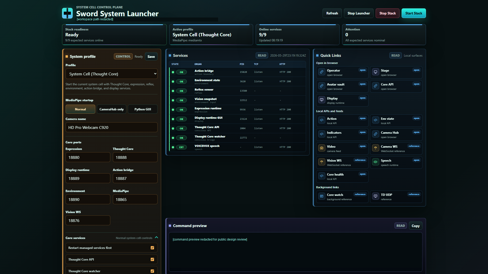

# Launcher UI Preview

This page is a GitHub-friendly reference for design review of the current
launcher screen.

The screenshot was copied from the local UI preview cache and redacted before
being committed. Local workspace paths and the full command preview body are
hidden. The remaining UI is intended to show the launcher layout, including the
System profile panel, service rack, Quick Links, and command preview placement.

## Design Review Focus

- Reconsider the left System profile panel as a launch configuration area, not
  only a compressed form.
- Keep Services and Quick Links as the primary first-viewport content.
- Decide which profile settings should stay visible, collapse into sections, or
  move to a detail/settings surface.
- Preserve readability for Japanese labels and long technical values.
