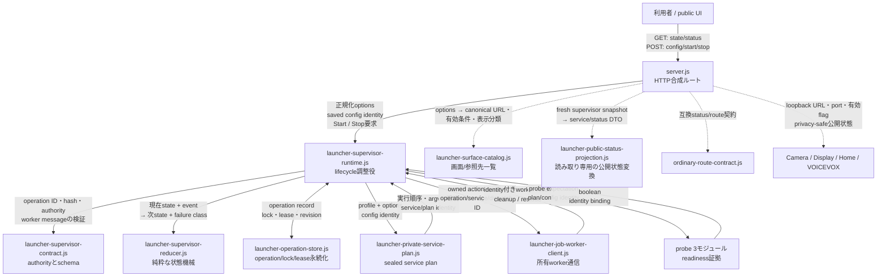
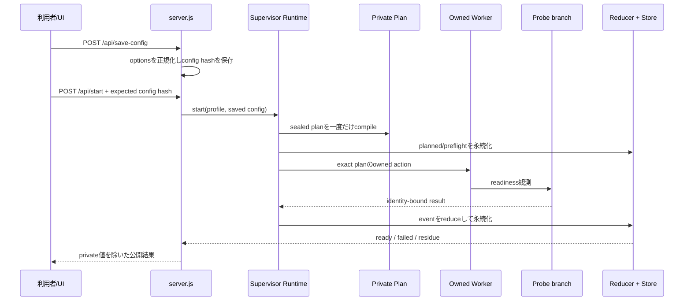
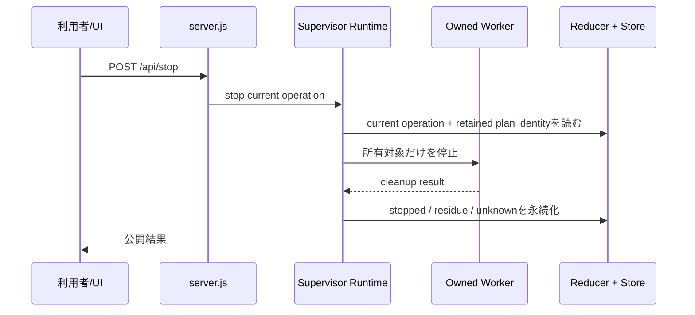
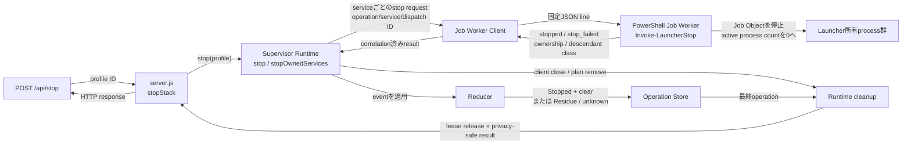

# Sword System Launcher 構成ガイド

この文書は、Launcherを人間が監査・修正するときの入口です。
機械向けschemaの説明ではなく、**どこが全体を支える根幹で、どこが枝の機能か**を示します。

## 1. 最初に覚えること

Launcherの目的は一つです。

> 選択されたSwordのservice群を、同じoperation identityの下で起動・観測・停止し、
> 不明な状態を成功に見せず、利用者には安全な要約だけを返す。

Launcher自身が会話、映像、音声、Camera、Home Controlの意味を決めるわけではありません。
それらのserviceを所有された一つのstackとして扱う**lifecycleの根**です。

## 2. 根幹と枝葉



実線がlifecycleの根幹です。点線はそこへ接続する枝です。
矢印上の文字は代表的な受け渡し内容で、完全なfield一覧ではありません。
秘密値、private planの完全record、raw PID/pathはpublic UIへ流さず、固定status、count、
boolean、利用者向けloopback URLへ変換してから返します。

### 根幹（spine）

| 順 | ファイル | 人間向けの役割 | ここに置かないもの |
| --- | --- | --- | --- |
| 1 | [`launcher-supervisor-contract.js`](./launcher-supervisor-contract.js) | 正しいID、hash、authority、worker messageの定義 | 起動処理、UI |
| 2 | [`launcher-supervisor-reducer.js`](./launcher-supervisor-reducer.js) | operationのphaseと失敗理由を決める純粋状態機械 | filesystem、HTTP、process起動 |
| 3 | [`launcher-operation-store.js`](./launcher-operation-store.js) | operation、lock、supervisor leaseをprivate領域へ安全に保存 | 公開DTO、製品機能の意味 |
| 4 | [`launcher-private-service-plan.js`](./launcher-private-service-plan.js) | profileから実行対象、順序、引数、環境をsealed planへ確定 | 実行、UI公開 |
| 5 | [`launcher-job-worker-client.js`](./launcher-job-worker-client.js) | planを実行する所有workerと固定JSON lineで通信 | 任意shell、semantic判断 |
| 6 | [`launcher-supervisor-runtime.js`](./launcher-supervisor-runtime.js) | 1〜5を束ね、Start/Stop/Recoveryを一つのoperationとして進める | HTTP route、画面描画 |

[`server.js`](./server.js)はこの根幹の**合成ルート**です。HTTP受付、設定保存、freshなSupervisor
snapshotの取得、公開responseの組立て、static UI配信を担当します。service状態とstartup timingの変換は
[`launcher-public-status-projection.js`](./launcher-public-status-projection.js)へ渡します。
Start/Stopの意味をserver.jsや公開状態変換だけで判断してはいけません。

### 証拠の枝（readiness probes）

| ファイル | 役割 |
| --- | --- |
| [`launcher-probe-runtime-context.js`](./launcher-probe-runtime-context.js) | private planから、観測に必要な最小contextだけを作る |
| [`launcher-probe-executor.js`](./launcher-probe-executor.js) | loopback HTTP/WebSocket/module statusを期限付きで観測する |
| [`launcher-probe-result-binding.js`](./launcher-probe-result-binding.js) | 観測結果をoperation/service/dispatch identityへ結び付ける |

Probeは「見えたもの」を返します。Readyへ進めるかはruntime/reducerが決めます。

### 利用者面の枝

| ファイル | 役割 |
| --- | --- |
| [`launcher-surface-catalog.js`](./launcher-surface-catalog.js) | Quick Linksに出す画面、API、feedのcanonical URL・有効条件・表示分類 |
| [`launcher-public-status-projection.js`](./launcher-public-status-projection.js) | Supervisorのpublic snapshotをservice状態とstartup timingへ変換する。I/O、cache、polling、Ready決定は持たない |
| [`public/index.html`](./public/index.html) | Launcher画面の骨格 |
| [`public/app.js`](./public/app.js) | 公開APIを読み、操作を送るブラウザUI |
| [`public/styles.css`](./public/styles.css) | 見た目 |
| [`config/default-profiles.json`](./config/default-profiles.json) | 利用者が選ぶ起動profile |

## 3. Startの読み順



重要点:

- `save-config`と`start`は別です。Startは保存済みhashを再確認します。
- planはStart途中の変化から再コンパイルしません。
- worker resultはoperation/service/dispatch identityが一致しなければ採用しません。
- HTTP 200やport listenだけではReadyになりません。

## 4. Stopの読み順



Stopは「portを使う何か」を無差別に終了する操作ではありません。
対象のplan・process lineage・listener ownershipが一致しない場合は停止せずHOLDします。

## 5. Operation stateの見方

主要phaseは `launcher-supervisor-reducer.js` の `PHASE` がauthorityです。

```text
planned
  -> preflight
  -> prepared
  -> starting
  -> waiting_ready
  -> ready

失敗時:
  -> rolling_back
  -> failed または residue

停止時:
  ready/active
  -> stopping
  -> stopped または residue
```

- `ready`: 選択serviceとsemantic probeが同じoperationへ結合した。
- `failed`: 起動は失敗したが、既知のowned cleanup境界で終わった。
- `residue`: 所有物が残った、または残っていないことを証明できない。
- `stopped`: Stop結果とcleanupがoperationへ結合した。

表示上の「失敗」と、source defect、製品機能の失敗、物理deviceの失敗は同義ではありません。

## 6. Publicとprivateの境界

### private側にだけ置くもの

- serviceの実引数と環境
- credential値
- private plan
- operation storeの完全record
- workerの内部結果
- local path、PID lineage、lock/lease nonce

### public UI/APIへ出してよいもの

- 固定されたstatus/reason class
- count、boolean、所要時間
- 有効/無効なservice名
- loopbackの利用者向けURL
- redact済みcommand preview

`server.js`の公開DTOへprivate planをそのまま載せてはいけません。

## 7. Projection Visualの三つの画面

canonical URLは `launcher-surface-catalog.js` が所有します。

| 画面 | 用途 | Effect receiver |
| --- | --- | --- |
| `Projection Visual` | 会話入力・調整を行うoperator | いいえ |
| `Projection Stage Output` | avatar・吹き出し・Fire/Thunderを合成する正式な投影出力 | **はい（唯一）** |
| `Passive Projection` | display-state互換表示 | いいえ |

Effectをoperatorにも受信させると、二つのreceiverが同じintentを実行し得ます。
そのため表示確認ではoperatorとstage-outputを分け、stage-outputを先に開きます。

`Projection Effect Diagnostic`は、既存のeffect transportを固定Fire/Thunder/Stop/Resetで
確認するoperator診断面です。上の三つのProjection Visual役割には加えず、production receiver、
Thought Coreの意味判断、LauncherのStart/Stop authorityにもなりません。診断時も先に
`Projection Stage Output`を開き、人間が最終表示を確認します。

## 8. APIの分類

### 読み取り

- `GET /api/state`: 設定、operation、endpointを含むUI用状態
- `GET /api/status`: 軽量なservice状態
- `GET /api/startup-timing`: 起動時間
- `GET /api/diagnostic-surfaces`: 診断面の索引
- `GET /api/video-input-devices`: local camera選択候補（loopback限定情報あり）

### 設定・実行

- `POST /api/preview`: command previewのみ
- `POST /api/save-config`: 正規化した設定とidentityを保存
- `POST /api/start`: 保存済みidentityを使って一回のStart
- `POST /api/stop`: 現operationのStop
- `POST /api/reclaim-managed-ports`: 互換のため残した廃止済み応答。`independent_reclaim_retired`と`kill_authority: false`を返し、processを終了しない
- `POST /api/shutdown`: Stop成功後にLauncher自身を終了

`/api/start`、`/api/stop`、`/api/reclaim-managed-ports`は同時実行されません。

## 9. 変更したいときに見る場所

| 目的 | 最初に見る場所 | 一緒に確認する場所 |
| --- | --- | --- |
| Quick LinkのURL・有効条件・表示分類を変える | [`launcher-surface-catalog.js`](./launcher-surface-catalog.js) | [`public/app.js`](./public/app.js)の翻訳・描画、[surface catalog test](../../tests/launcher-surface-catalog.test.js) |
| 起動対象serviceを変える | [`launcher-private-service-plan.js`](./launcher-private-service-plan.js) | [supervisor contract](./launcher-supervisor-contract.js)、manifest/pins |
| Ready条件を変える | probe 3モジュール | reducer、runtime、focused tests |
| Stop条件を変える | [`launcher-supervisor-runtime.js`](./launcher-supervisor-runtime.js) | [reducer](./launcher-supervisor-reducer.js)、[operation store](./launcher-operation-store.js)、[worker tests](../../tests/launcher-job-worker.test.js) |
| phase/reasonを変える | [`launcher-supervisor-reducer.js`](./launcher-supervisor-reducer.js) | reducer vectors、public mapping |
| service状態やstartup timingの公開変換を変える | [`launcher-public-status-projection.js`](./launcher-public-status-projection.js) | [`server.js`](./server.js)の`getStatus`、focused projection test |
| UIを変える | [`public/app.js`](./public/app.js) / [`index.html`](./public/index.html) | `/api/state`の公開schema |
| Camera選択を変える | [`launcher-camera-adapter.js`](./launcher-camera-adapter.js) | [`server.js`](./server.js)の合成、privacy/redaction tests |
| process停止・cleanupを変える | [`launcher-supervisor-runtime.js`](./launcher-supervisor-runtime.js) | worker/reducer、ownership/lineage tests |
| 廃止済みport回収APIの返答を変える | [`server.js`](./server.js)の`reclaimManagedPortsFromLauncher` | managed-port cutover test |

## 10. 現在の複雑さと、次の安全な分離順

現時点でも `server.js` と `public/app.js` は大きく、根幹と枝の読解を難しくしています。
一度に全面移動するとStart/Stopの境界を壊すため、依存とテストを同じpacketで閉じられる枝から分離します。

1. **完了**: 画面URL一覧を `launcher-surface-catalog.js` へ抽出。
2. **完了**: status aggregationを `launcher-public-status-projection.js` へ読み取り専用で抽出。
3. **完了**: 到達不能だった旧managed-port強制回収実装を削除。互換APIはkill権限なしの廃止応答だけを返す。
4. **完了**: camera enumeration/selection/redactionを `launcher-camera-adapter.js` へ抽出。
5. 次: owner valueへ直接つながる枝を、既存authorityとconsumerを一packetで閉じられる場合だけ分離。

各段階で既存テストを維持し、Start/Stopの意味を変更しません。

## 11. 人間による監査チェックリスト

変更を見るときは次の順で確認します。

1. 変更は根幹か枝か。
2. そのファイルが本来所有する責務か。
3. authority・operation identity・plan identityを飛び越えていないか。
4. unknownをfalse/0/成功へ変えていないか。
5. private値がUI/APIへ漏れていないか。
6. Start/Stop/retry回数を増やしていないか。
7. focused testは変更した境界を直接検査しているか。

「根幹を変える必要がある」と思った場合は、まず枝側の入口・adapter・表示分類の欠落を確認します。
今回のProjection Effectsでは、effect engineではなくstage-outputへの入口が欠けていました。

## 12. Cleanup判定はどこで行うか

ここでいうoperation recordの`cleanup: clear`は、**全製品機能が実現・完成したという意味ではありません**。
Launcherが所有するservice群について、Stop結果を同じoperationへ結合し、Reducerが既知の残存を
成功扱いしていないことを表します。Stop API全体の成功には、さらにworker client・private planの片付けと
supervisor leaseの解放まで必要です。



### 実装を読む順番

| 順 | 場所 | 何を判定・実行するか |
| --- | --- | --- |
| 1 | [`server.js`: `stopStack`と`/api/stop`](./server.js) | UI/APIのStop要求からactive profileを選び、Runtimeへ渡す |
| 2 | [`launcher-supervisor-runtime.js`: `stop` / `stopOwnedServices`](./launcher-supervisor-runtime.js) | private planを復元し、所有serviceを逆順で一度ずつ止め、client・plan・leaseを片付ける |
| 3 | [`launcher-job-worker-client.js`](./launcher-job-worker-client.js) | operation/service/dispatch identity付きの固定request/resultをPowerShell workerと交換する |
| 4 | [`launcher-job-worker.ps1`: `Invoke-LauncherStop`](../../ops/scripts/home-control-stack/launcher-job-worker.ps1) | process identityとlistener ownershipを確認し、Job Objectを停止してactive process count 0を待つ |
| 5 | [`launcher-supervisor-reducer.js`: `serviceStopped` / `residue`](./launcher-supervisor-reducer.js) | `stopped + owned_clear`をstateへ反映し、失敗・不明なら`residue`または`unknown`にする |
| 6 | [`launcher-operation-store.js`](./launcher-operation-store.js) | 最終operation、lock、supervisor leaseをprivate storeへ保存・検証する |

worker messageとoperation recordのfield定義は、
[`launcher-worker.v2.schema.json`](../../contracts/launcher/launcher-worker.v2.schema.json) と
[`launcher-operation.v2.schema.json`](../../contracts/launcher/launcher-operation.v2.schema.json) から確認できます。

主なテストは
[`launcher-supervisor-runtime.test.js`](../../tests/launcher-supervisor-runtime.test.js) と
[`launcher-job-worker.test.js`](../../tests/launcher-job-worker.test.js) です。特に、Stop成功、別profile拒否、
private plan不明時のfail-closed、worker crash後のrecovery、cleanup失敗時のresidue保持を確認します。

### operation recordの`cleanup: clear`が意味する範囲

- owned serviceがすべて`stopped`または`optional_absent`
- `residue_service_ids`が空
- rollback/recoveryが未完了でない
- 採用されたowned serviceのStop結果が`ownership_class=matched`かつ`descendant_class=owned_clear`
- owned Jobが存在した場合、workerがJob Object内のactive process count 0を確認した

### Stop APIが`ok: true`になるための追加条件

- worker clientのcloseとprivate planのremoveが成功した
- 最終operationが`stopped`になった
- Stop operation完了後にsupervisor leaseを解放できた

### 含まれないもの

- 会話、avatar、音声、Fire/Thunderなど全製品機能の完成証明
- Chrome tab、page hook、JavaScript globalの最終不在
- Launcher所有外の外部serviceやdeviceが停止した証明
- 画面上の表示が消えたことや、projectorの物理状態
- ユーザーが体験を受け入れたというU1証明

過去の「完全cleanup証明」は、この製品内の`cleanup: clear`より広く、Chrome・browser hook・root directory・
listener・元operationとの履歴同一性まで一度に証明しようとしました。しかし、その一部には後から安全に
再観測するpublic APIや保持identityがありませんでした。機能実装そのものより、**不在を証明する観測面が
不足していたこと**が難航の主因です。
