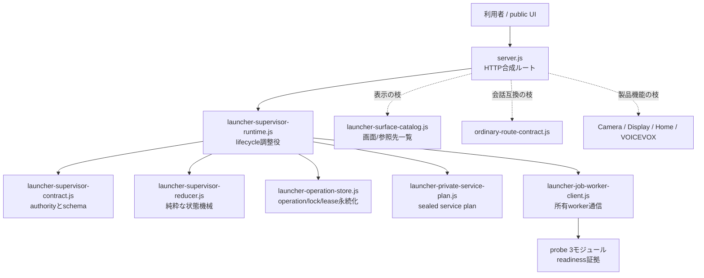
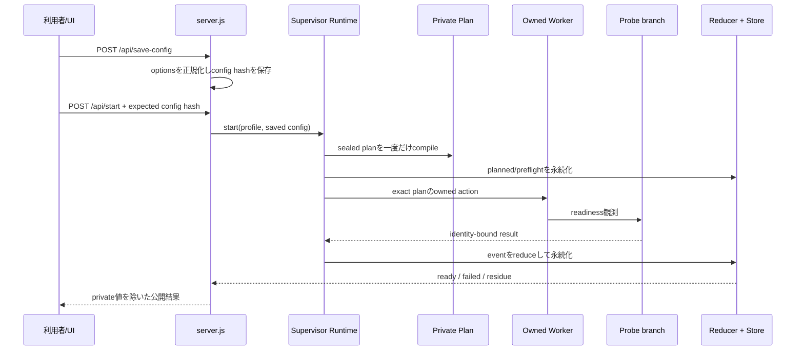
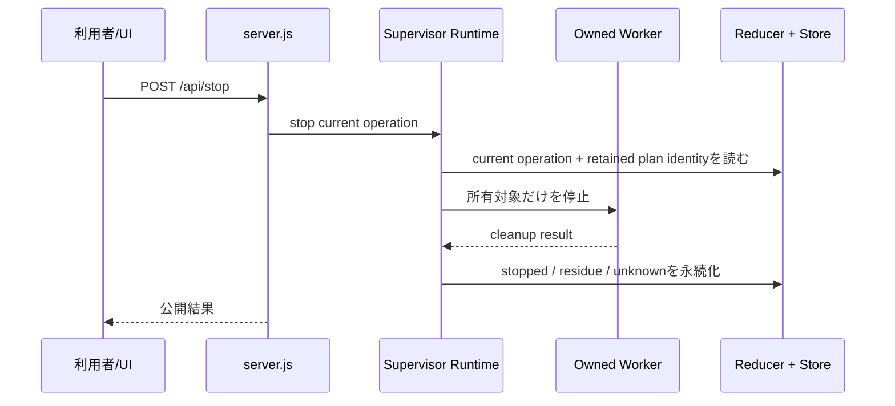

# Sword System Launcher 構成ガイド

この文書は、Launcherを人間が監査・修正するときの入口です。
機械向けschemaの説明ではなく、**どこが全体を支える根幹で、どこが枝の機能か**を示します。

## 1. 最初に覚えること

Launcherの目的は一つです。

> 選択されたSwordのservice群を、同じoperation identityの下で起動・観測・停止し、
> 不明な状態を成功に見せず、利用者には安全な要約だけを返す。

Launcher自身が会話、映像、音声、Camera、Home Controlの意味を決めるわけではありません。
それらのserviceを所有された一つのstackとして扱う**lifecycleの根**です。

## 2. 根幹と枝葉



実線がlifecycleの根幹です。点線はそこへ接続する枝です。

### 根幹（spine）

| 順 | ファイル | 人間向けの役割 | ここに置かないもの |
| --- | --- | --- | --- |
| 1 | `launcher-supervisor-contract.js` | 正しいID、hash、authority、worker messageの定義 | 起動処理、UI |
| 2 | `launcher-supervisor-reducer.js` | operationのphaseと失敗理由を決める純粋状態機械 | filesystem、HTTP、process起動 |
| 3 | `launcher-operation-store.js` | operation、lock、supervisor leaseをprivate領域へ安全に保存 | 公開DTO、製品機能の意味 |
| 4 | `launcher-private-service-plan.js` | profileから実行対象、順序、引数、環境をsealed planへ確定 | 実行、UI公開 |
| 5 | `launcher-job-worker-client.js` | planを実行する所有workerと固定JSON lineで通信 | 任意shell、semantic判断 |
| 6 | `launcher-supervisor-runtime.js` | 1〜5を束ね、Start/Stop/Recoveryを一つのoperationとして進める | HTTP route、画面描画 |

`server.js`はこの根幹の**合成ルート**です。HTTP受付、設定保存、公開状態への変換、
static UI配信を担当します。Start/Stopの意味をserver.jsだけで判断してはいけません。

### 証拠の枝（readiness probes）

| ファイル | 役割 |
| --- | --- |
| `launcher-probe-runtime-context.js` | private planから、観測に必要な最小contextだけを作る |
| `launcher-probe-executor.js` | loopback HTTP/WebSocket/module statusを期限付きで観測する |
| `launcher-probe-result-binding.js` | 観測結果をoperation/service/dispatch identityへ結び付ける |

Probeは「見えたもの」を返します。Readyへ進めるかはruntime/reducerが決めます。

### 利用者面の枝

| ファイル | 役割 |
| --- | --- |
| `launcher-surface-catalog.js` | Quick Linksに出す画面、API、feedの一覧とcanonical URL |
| `public/index.html` | Launcher画面の骨格 |
| `public/app.js` | 公開APIを読み、操作を送るブラウザUI |
| `public/styles.css` | 見た目 |
| `config/default-profiles.json` | 利用者が選ぶ起動profile |

## 3. Startの読み順



重要点:

- `save-config`と`start`は別です。Startは保存済みhashを再確認します。
- planはStart途中の変化から再コンパイルしません。
- worker resultはoperation/service/dispatch identityが一致しなければ採用しません。
- HTTP 200やport listenだけではReadyになりません。

## 4. Stopの読み順



Stopは「portを使う何か」を無差別に終了する操作ではありません。
対象のplan・process lineage・listener ownershipが一致しない場合は停止せずHOLDします。

## 5. Operation stateの見方

主要phaseは `launcher-supervisor-reducer.js` の `PHASE` がauthorityです。

```text
planned
  -> preflight
  -> prepared
  -> starting
  -> waiting_ready
  -> ready

失敗時:
  -> rolling_back
  -> failed または residue

停止時:
  ready/active
  -> stopping
  -> stopped または residue
```

- `ready`: 選択serviceとsemantic probeが同じoperationへ結合した。
- `failed`: 起動は失敗したが、既知のowned cleanup境界で終わった。
- `residue`: 所有物が残った、または残っていないことを証明できない。
- `stopped`: Stop結果とcleanupがoperationへ結合した。

表示上の「失敗」と、source defect、製品機能の失敗、物理deviceの失敗は同義ではありません。

## 6. Publicとprivateの境界

### private側にだけ置くもの

- serviceの実引数と環境
- credential値
- private plan
- operation storeの完全record
- workerの内部結果
- local path、PID lineage、lock/lease nonce

### public UI/APIへ出してよいもの

- 固定されたstatus/reason class
- count、boolean、所要時間
- 有効/無効なservice名
- loopbackの利用者向けURL
- redact済みcommand preview

`server.js`の公開DTOへprivate planをそのまま載せてはいけません。

## 7. Projection Visualの三つの画面

canonical URLは `launcher-surface-catalog.js` が所有します。

| 画面 | 用途 | Effect receiver |
| --- | --- | --- |
| `Projection Visual` | 会話入力・調整を行うoperator | いいえ |
| `Projection Stage Output` | avatar・吹き出し・Fire/Thunderを合成する正式な投影出力 | **はい（唯一）** |
| `Passive Projection` | display-state互換表示 | いいえ |

Effectをoperatorにも受信させると、二つのreceiverが同じintentを実行し得ます。
そのため表示確認ではoperatorとstage-outputを分け、stage-outputを先に開きます。

## 8. APIの分類

### 読み取り

- `GET /api/state`: 設定、operation、endpointを含むUI用状態
- `GET /api/status`: 軽量なservice状態
- `GET /api/startup-timing`: 起動時間
- `GET /api/diagnostic-surfaces`: 診断面の索引
- `GET /api/video-input-devices`: local camera選択候補（loopback限定情報あり）

### 設定・実行

- `POST /api/preview`: command previewのみ
- `POST /api/save-config`: 正規化した設定とidentityを保存
- `POST /api/start`: 保存済みidentityを使って一回のStart
- `POST /api/stop`: 現operationのStop
- `POST /api/reclaim-managed-ports`: ownershipが証明された管理対象だけを回収
- `POST /api/shutdown`: Stop成功後にLauncher自身を終了

`/api/start`、`/api/stop`、`/api/reclaim-managed-ports`は同時実行されません。

## 9. 変更したいときに見る場所

| 目的 | 最初に見る場所 | 一緒に確認する場所 |
| --- | --- | --- |
| Quick Linkや表示URLを変える | `launcher-surface-catalog.js` | `public/app.js`、surface catalog test |
| 起動対象serviceを変える | `launcher-private-service-plan.js` | supervisor contract、manifest/pins |
| Ready条件を変える | probe 3モジュール | reducer、runtime、focused tests |
| Stop条件を変える | `launcher-supervisor-runtime.js` | reducer、operation store、worker tests |
| phase/reasonを変える | `launcher-supervisor-reducer.js` | reducer vectors、public mapping |
| UIを変える | `public/app.js` / `index.html` | `/api/state`の公開schema |
| Camera選択を変える | `server.js`のcamera section | privacy/redaction tests |
| process回収を変える | `server.js`のmanaged-port section | ownership/lineage tests |

## 10. 現在の複雑さと、次の安全な分離順

現時点でも `server.js` と `public/app.js` は大きく、根幹と枝の読解を難しくしています。
一度に全面移動するとStart/Stopの境界を壊すため、次の順で分離します。

1. **完了**: 画面URL一覧を `launcher-surface-catalog.js` へ抽出。
2. 次: camera enumeration/redactionを独立moduleへ抽出。
3. 次: managed-port ownership/reclaimを独立moduleへ抽出。
4. 次: status aggregationをread-only moduleへ抽出。
5. 最後: HTTP route tableを薄いrouterへ抽出。

各段階で既存テストを維持し、Start/Stopの意味を変更しません。

## 11. 人間による監査チェックリスト

変更を見るときは次の順で確認します。

1. 変更は根幹か枝か。
2. そのファイルが本来所有する責務か。
3. authority・operation identity・plan identityを飛び越えていないか。
4. unknownをfalse/0/成功へ変えていないか。
5. private値がUI/APIへ漏れていないか。
6. Start/Stop/retry回数を増やしていないか。
7. focused testは変更した境界を直接検査しているか。

「根幹を変える必要がある」と思った場合は、まず枝側の入口・adapter・表示分類の欠落を確認します。
今回のProjection Effectsでは、effect engineではなくstage-outputへの入口が欠けていました。
